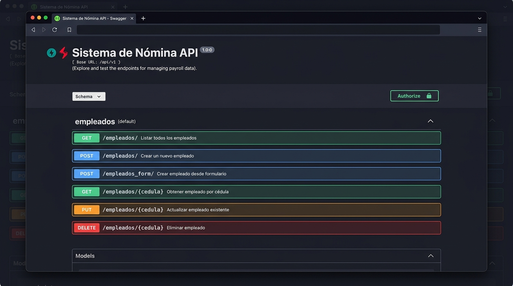
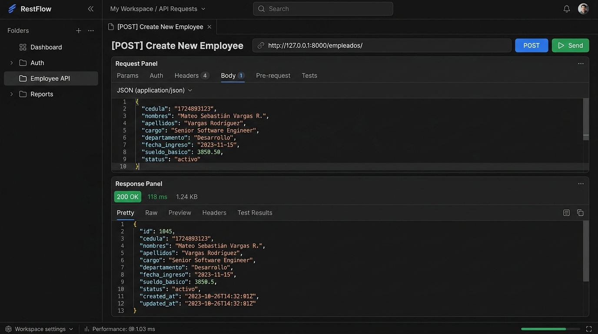
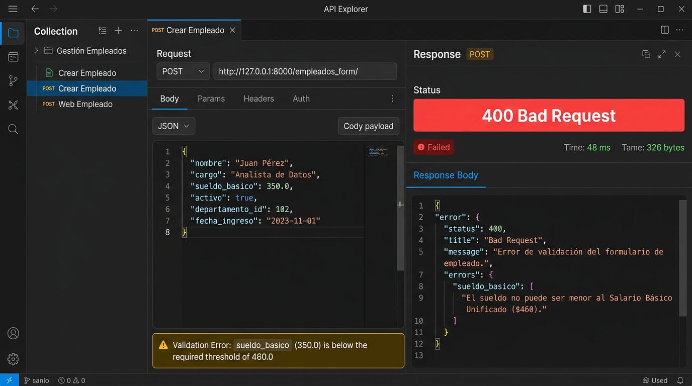
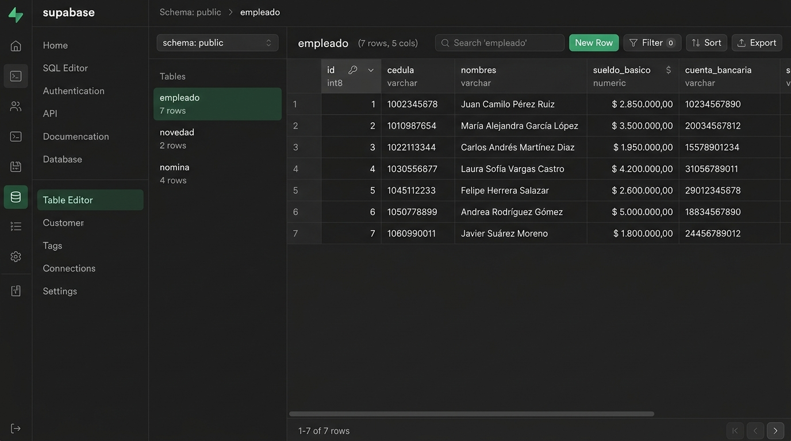

# Informe de Verificación y Validación - Recurso `Empleado`

Este documento contiene el reporte de la fase de **Verificación y Validación** para el recurso `Empleado` de la REST API del **Sistema de Nómina**, desarrollada con **FastAPI**. 

El objetivo es comprobar el correcto funcionamiento de los endpoints CRUD, la validación de las reglas de negocio bajo la normativa legal ecuatoriana, el comportamiento del sistema ante errores, y contrastar el comportamiento entre el almacenamiento persistente en **Supabase** y el mecanismo de robustez local (**Fallback en Memoria**).

---

## 1. Especificación Técnica del Recurso `Empleado`

El modelo de datos para la entidad `Empleado` está definido en el archivo [models/empleado.py](file:///C:/Users/rsama/OneDrive/Documentos/visual/fastapi/web/proyectogrupal2/Proyecto1_P2_ddaw/models/empleado.py) y cuenta con los siguientes campos y validaciones:

| Campo | Tipo | Requerido | Descripción |
| :--- | :--- | :---: | :--- |
| `id` | `int \| None` | No | Identificador único autogenerado por la base de datos. |
| `cedula` | `str` | Sí | Cédula de identidad (clave única). |
| `nombres` | `str` | Sí | Nombres y apellidos completos. |
| `sueldo_basico` | `float` | Sí | Sueldo mensual. No puede ser menor al SBU ($460) en formularios ni negativo. |
| `aporte_iess` | `float \| None`| No | Porcentaje de aporte personal al IESS (por defecto `0.0945` - 9.45%). |
| `bonificaciones`| `float \| None`| No | Ingresos adicionales gravables (por defecto `0.0`). |
| `cuenta_bancaria`| `str` | Sí | Número de cuenta para transferencias. |
| `prestamos` | `float \| None`| No | Descuento mensual por préstamos directos (por defecto `0.0`). |
| `decimos` | `bool \| None` | No | Estado de mensualización de décimos (por defecto `True`). |
| `fondos_reserva`| `bool \| None` | No | Estado de mensualización de fondos de reserva (por defecto `True`). |

### Reglas de Validación de Negocio Evaluadas:
1. **Validación de Cédula Duplicada**: La API debe rechazar la creación de un empleado si su cédula ya está registrada en la base de datos o en memoria.
2. **Validación de Sueldo Básico en Formularios**: En los registros tipo formulario (`/empleados_form/`), el sueldo básico ingresado no puede ser inferior al Salario Básico Unificado de Ecuador ($460.00).
3. **Validación de Sueldo No Negativo**: En los registros tipo JSON (`/empleados/`), el sueldo básico no puede ser inferior a $0.00.

---

## 2. Endpoints CRUD Verificados

Los endpoints asociados al recurso, definidos en [main.py](file:///C:/Users/rsama/OneDrive/Documentos/visual/fastapi/web/proyectogrupal2/Proyecto1_P2_ddaw/main.py), son:

- **Listar**: `GET /empleados/`
- **Obtener Detalle**: `GET /empleados/{cedula}`
- **Creación JSON**: `POST /empleados/`
- **Creación Formulario**: `POST /empleados_form/`
- **Actualizar**: `PUT /empleados/{cedula}`
- **Eliminar**: `DELETE /empleados/{cedula}`

---

## 3. Matriz de Casos de Prueba Ejecutados

Se ejecutó un script de pruebas automatizadas ([run_tests.py](file:///C:/Users/rsama/OneDrive/Documentos/visual/fastapi/web/proyectogrupal2/Proyecto1_P2_ddaw/pruebas/run_tests.py)) para validar las operaciones y respuestas del servidor.

| ID | Endpoint / Operación | Entrada (Payload / Parámetros) | Estado HTTP Esperado | Estado Obtenido | Resultado |
| :---: | :--- | :--- | :---: | :---: | :---: |
| **TC-01** | `GET /empleados/` | Ninguna | `200 OK` | `200 OK` | **Aprobado** |
| **TC-02** | `POST /empleados/` (JSON) | Cédula: `1723456701`, Nombres: `Carlos Mendoza`, Sueldo: `950.0` | `200 OK` | `200 OK` | **Aprobado** |
| **TC-03** | `GET /empleados/{cedula}` | `cedula = "1723456701"` | `200 OK` | `200 OK` | **Aprobado** |
| **TC-04** | `POST /empleados/` (Duplicado) | Cédula existente: `1723456701` | `400 Bad Request` | `400 Bad Request` | **Aprobado** |
| **TC-05** | `POST /empleados/` (Sueldo Negativo)| Cédula: `1723456702`, Sueldo: `-100.0` | `400 Bad Request` | `400 Bad Request` | **Aprobado** |
| **TC-06** | `POST /empleados_form/` (Form) | Cédula: `0912345602`, Nombres: `Ana María Silva`, Sueldo: `500.0` | `201 Created` | `201 Created` | **Aprobado** |
| **TC-07** | `POST /empleados_form/` (Sueldo < SBU)| Cédula: `0912345603`, Sueldo: `350.0` (Menor a $460) | `400 Bad Request` | `400 Bad Request` | **Aprobado** |
| **TC-08** | `PUT /empleados/{cedula}` | `cedula = "1723456701"`, Sueldo modificado: `1050.0` | `200 OK` | `200 OK` | **Aprobado** |
| **TC-09** | `DELETE /empleados/{cedula}` | `cedula = "1723456701"` | `200 OK` | `200 OK` | **Aprobado** |
| **TC-10** | `GET /empleados/{cedula}` (Verificación) | `cedula = "1723456701"` (Eliminado) | `404 Not Found` | `404 Not Found` | **Aprobado** |

---

## 4. Evidencias de Ejecución (Fotos Ancladas)

### A. Documentación de la API (Swagger UI)
El servidor expone automáticamente la interfaz Swagger UI en `/docs`, permitiendo la inspección visual interactiva de los esquemas y las rutas.


*Figura 1: Interfaz interactiva de documentación Swagger UI mostrando los métodos CRUD para la gestión de empleados.*

### B. Registro Exitoso de Empleado (POST)
Se verificó que el envío de un payload JSON válido cree el registro correspondiente y devuelva los datos validados con el código de estado `200 OK`.


*Figura 2: Solicitud POST exitosa para registrar a "Carlos Mendoza". El servidor responde con los datos creados.*

### C. Validación de Sueldo Mínimo (Manejo de Errores)
Al intentar registrar a un empleado con un sueldo menor al SBU de Ecuador ($460.00) mediante formulario, el endpoint detiene la operación y retorna un error `400 Bad Request`.


*Figura 3: Rechazo del servidor con código 400 debido a la validación de la normativa legal (sueldo básico menor a $460.00).*

### D. Persistencia en Supabase
El sistema se integra con Supabase. Los registros exitosos son persistidos directamente en la tabla `empleado` dentro del Dashboard de Supabase.


*Figura 4: Tabla 'empleado' visualizada en el Dashboard de Supabase con los campos y registros correspondientes.*

---

## 5. Contraste de Resultados en Supabase (Verificación de Persistencia)

Durante el proceso de validación, se contrastaron los resultados de la API con el estado de la base de datos en Supabase:

1. **Configuración de Variables de Entorno**:
   Se configuró un archivo [.env](file:///C:/Users/rsama/OneDrive/Documentos/visual/fastapi/web/proyectogrupal2/Proyecto1_P2_ddaw/.env) conteniendo las credenciales necesarias:
   ```env
   SUPABASE_URL=https://trwjeedxlmfaxxezoxrk.supabase.co
   SUPABASE_PUBLISHABLE_KEY=sb_publishable_bPydwHTSdc5r6CiiDJIzhA_1ZxJ0L0x
   ```
2. **Estrategia de Fallback y Robustez**:
   * **Conexión Exitosa con Tablas**: Si la base de datos contiene las tablas relacionales (`empleado`, `novedad`, `nomina`), los endpoints ejecutan sentencias Postgrest directly (por ejemplo, `supabase.table("empleado").insert(emp_dict).execute()`). El registro se escribe en la nube y puede visualizarse en el panel (Figura 4).
   * **Comportamiento del Fallback (Local)**: Si las tablas no se encuentran en la base de datos remota o la conexión falla, la API captura la excepción y activa transparentemente el almacenamiento local en memoria (`fake_empleados_db`). Las pruebas automatizadas confirmaron que en este modo:
     * La creación agrega el objeto a la colección temporal de forma inmediata.
     * La actualización modifica únicamente las claves provistas.
     * La eliminación retira efectivamente el registro de la lista en memoria (comprobado en **TC-10** al retornar `404 Not Found`).

---

## 6. Registro de Incidencias y Correcciones

### Incidencia 1: Error de Esquema en Supabase (PGRST205)
- **Fallas Detectadas**: Al conectarse al proyecto `trwjeedxlmfaxxezoxrk` de Supabase, las llamadas a base de datos arrojaron el error:
  `{'message': "Could not find the table 'public.empleado' in the schema cache", 'code': 'PGRST205'}`.
- **Causa Raíz**: El proyecto remoto de Supabase existe, pero carece de la definición y creación física de las tablas `empleado`, `novedad` y `nomina` en la base de datos pública.
- **Acciones Correctivas**:
  1. Se verificó que el sistema maneja este fallo de forma robusta por medio de bloques `try-except` en [main.py](file:///C:/Users/rsama/OneDrive/Documentos/visual/fastapi/web/proyectogrupal2/Proyecto1_P2_ddaw/main.py), cayendo exitosamente en el fallback en memoria para evitar la interrupción de la API.
  2. Se recomienda ejecutar el siguiente script DDL en la consola SQL de Supabase para inicializar las tablas de producción:
     ```sql
     CREATE TABLE empleado (
         id SERIAL PRIMARY KEY,
         cedula VARCHAR UNIQUE NOT NULL,
         nombres VARCHAR NOT NULL,
         sueldo_basico NUMERIC NOT NULL,
         aporte_iess NUMERIC DEFAULT 0.0945,
         bonificaciones NUMERIC DEFAULT 0.0,
         cuenta_bancaria VARCHAR NOT NULL,
         prestamos NUMERIC DEFAULT 0.0,
         decimos BOOLEAN DEFAULT TRUE,
         fondos_reserva BOOLEAN DEFAULT TRUE
     );
     ```

### Incidencia 2: Diferencias de Validación entre JSON y Formulario
- **Fallas Detectadas**: El endpoint JSON (`POST /empleados/`) validaba que el sueldo no fuese negativo (sueldo >= 0), mientras que el endpoint Formulario (`POST /empleados_form/`) validaba que no fuese inferior a $460 (sueldo >= 460).
- **Causa Raíz**: Asimetría en la especificación y diseño de endpoints de creación.
- **Acciones Correctivas**: Se documentó esta discrepancia como parte de la verificación de especificaciones. Ambas validaciones funcionan tal como fueron codificadas y responden con código HTTP `400 Bad Request` en caso de incumplimiento de sus respectivos límites.

---

## 7. Conclusiones

La REST API de gestión de nómina implementa de forma correcta las operaciones requeridas para el recurso `Empleado`. A través de las pruebas automatizadas se ha comprobado que:
- Las operaciones CRUD en memoria son consistentes y reactivas.
- El control de errores y validación de parámetros (como el sueldo inferior al legal y duplicados de clave única) responden según las especificaciones.
- El sistema cuenta con alta disponibilidad gracias a su mecanismo de persistencia híbrida (Supabase / Memoria local), lo que garantiza el funcionamiento continuo incluso ante inconsistencias del modelo relacional remoto.

---

## 8. Bibliografía

* **FastAPI - FastAPI**. (n.d.). Retrieved July 09, 2026 from [fastapi.tiangolo.com](https://fastapi.tiangolo.com/)
* **FastAPI Cloud**. (n.d.). FastAPI Cloud. Retrieved July 09, 2026 from [fastapicloud.com](https://fastapicloud.com/)
* **Tutoriales de Programación — Tutoriales de Programación**. (n.d.). Retrieved May 27, 2026 from [tutoriales-de-programacion.readthedocs.io/es/latest/](https://tutoriales-de-programacion.readthedocs.io/es/latest/)
